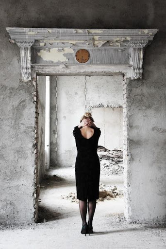
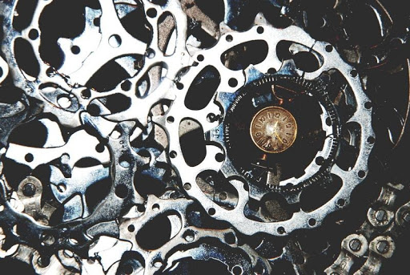
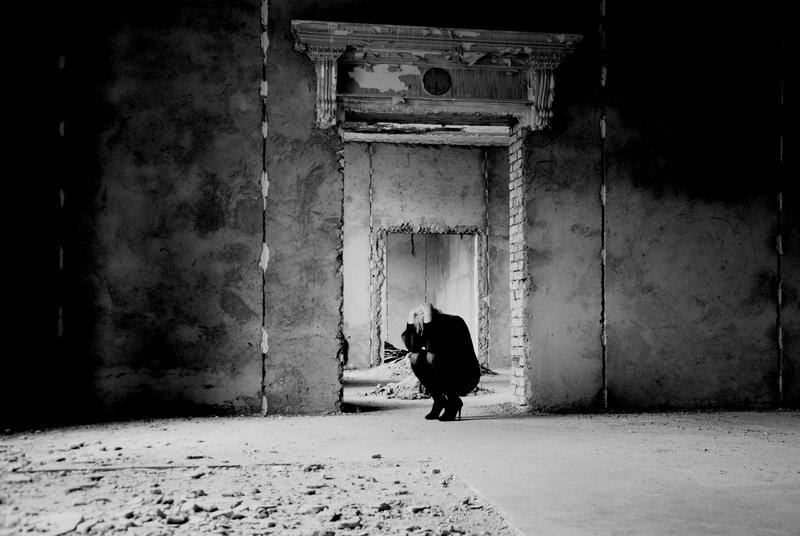
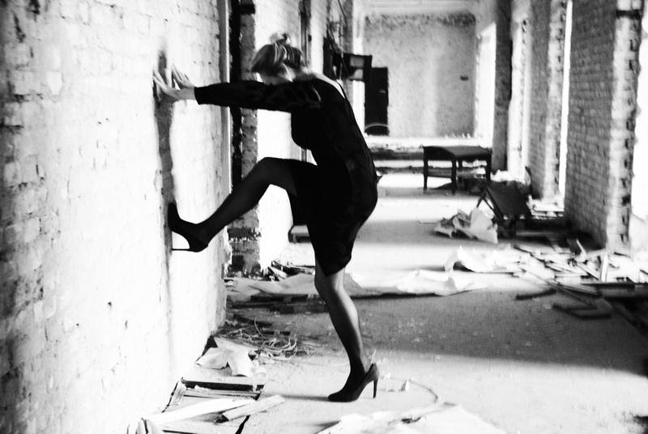

## Мало текста - большие картинки clearfix

  

    
  

  

    The method of transformation of acute mental pain through photo visualization, i.e. the opportunity to see yourself from the outside, a way to return yourself to an active life.
    This time the heartache was unbearable. This is the loss of one's “I”, a “living corpse” performing mechanical movements, this is a restless brain that does not give sleep, not even a second of respite ... The key turn to reviving oneself, the ability to stand on the ruins of one's life was the creation of a photo collage from one's own photographs. On them I am strong, happy and beautiful. I put a photo collage on my laptop's desktop.
  

  

     
  

  

    And each time, opening it, I saw from the side of myself the same. Thanks to this, I remembered my true "I"! The rebirth from the ashes has begun ...
    Having experienced such an experience, I wanted to share it, try to visualize acute mental pain: convey it through a photograph, see it from the outside, and thus stimulate recovery, reduce human suffering. The case presented itself. A friend found herself in a critical state of mind, trying to cope with acute pain on her own.
  

## Мало текста - большие картинки

  

The method of transformation of acute mental pain through photo visualization, i.e. the opportunity to see yourself from the outside, a way to return yourself to an active life.
This time the heartache was unbearable. This is the loss of one's “I”, a “living corpse” performing mechanical movements, this is a restless brain that does not give sleep, not even a second of respite ... The key turn to reviving oneself, the ability to stand on the ruins of one's life was the creation of a photo collage from one's own photographs. On them I am strong, happy and beautiful. I put a photo collage on my laptop's desktop.

   

And each time, opening it, I saw from the side of myself the same. Thanks to this, I remembered my true "I"! The rebirth from the ashes has begun ...
Having experienced such an experience, I wanted to share it, try to visualize acute mental pain: convey it through a photograph, see it from the outside, and thus stimulate recovery, reduce human suffering. The case presented itself. A friend found herself in a critical state of mind, trying to cope with acute pain on her own.

## Больше текста - большие картинки

  

The method of transformation of acute mental pain through photo visualization, i.e. the opportunity to see yourself from the outside, a way to return yourself to an active life.
This time the heartache was unbearable. This is the loss of one's “I”, a “living corpse” performing mechanical movements, this is a restless brain that does not give sleep, not even a second of respite ... The key turn to reviving oneself, the ability to stand on the ruins of one's life was the creation of a photo collage from one's own photographs. On them I am strong, happy and beautiful. I put a photo collage on my laptop's desktop.

And each time, opening it, I saw from the side of myself the same. Thanks to this, I remembered my true "I"! The rebirth from the ashes has begun ...
Having experienced such an experience, I wanted to share it, try to visualize acute mental pain: convey it through a photograph, see it from the outside, and thus stimulate recovery, reduce human suffering. The case presented itself. A friend found herself in a critical state of mind, trying to cope with acute pain on her own.

The method of transformation of acute mental pain through photo visualization, i.e. the opportunity to see yourself from the outside, a way to return yourself to an active life.
This time the heartache was unbearable. This is the loss of one's “I”, a “living corpse” performing mechanical movements, this is a restless brain that does not give sleep, not even a second of respite ... The key turn to reviving oneself, the ability to stand on the ruins of one's life was the creation of a photo collage from one's own photographs. On them I am strong, happy and beautiful. I put a photo collage on my laptop's desktop.

And each time, opening it, I saw from the side of myself the same. Thanks to this, I remembered my true "I"! The rebirth from the ashes has begun ...
Having experienced such an experience, I wanted to share it, try to visualize acute mental pain: convey it through a photograph, see it from the outside, and thus stimulate recovery, reduce human suffering. The case presented itself. A friend found herself in a critical state of mind, trying to cope with acute pain on her own.

   

The method of transformation of acute mental pain through photo visualization, i.e. the opportunity to see yourself from the outside, a way to return yourself to an active life.
This time the heartache was unbearable. This is the loss of one's “I”, a “living corpse” performing mechanical movements, this is a restless brain that does not give sleep, not even a second of respite ... The key turn to reviving oneself, the ability to stand on the ruins of one's life was the creation of a photo collage from one's own photographs. On them I am strong, happy and beautiful. I put a photo collage on my laptop's desktop.

And each time, opening it, I saw from the side of myself the same. Thanks to this, I remembered my true "I"! The rebirth from the ashes has begun ...
Having experienced such an experience, I wanted to share it, try to visualize acute mental pain: convey it through a photograph, see it from the outside, and thus stimulate recovery, reduce human suffering. The case presented itself. A friend found herself in a critical state of mind, trying to cope with acute pain on her own.

The method of transformation of acute mental pain through photo visualization, i.e. the opportunity to see yourself from the outside, a way to return yourself to an active life.
This time the heartache was unbearable. This is the loss of one's “I”, a “living corpse” performing mechanical movements, this is a restless brain that does not give sleep, not even a second of respite ... The key turn to reviving oneself, the ability to stand on the ruins of one's life was the creation of a photo collage from one's own photographs. On them I am strong, happy and beautiful. I put a photo collage on my laptop's desktop.

And each time, opening it, I saw from the side of myself the same. Thanks to this, I remembered my true "I"! The rebirth from the ashes has begun ...
Having experienced such an experience, I wanted to share it, try to visualize acute mental pain: convey it through a photograph, see it from the outside, and thus stimulate recovery, reduce human suffering. The case presented itself. A friend found herself in a critical state of mind, trying to cope with acute pain on her own.

And each time, opening it, I saw from the side of myself the same. Thanks to this, I remembered my true "I"! The rebirth from the ashes has begun ...
Having experienced such an experience, I wanted to share it, try to visualize acute mental pain: convey it through a photograph, see it from the outside, and thus stimulate recovery, reduce human suffering. The case presented itself. A friend found herself in a critical state of mind, trying to cope with acute pain on her own.

## Grid 2 Cols

### Пример 1

  

     
  

  

     
  

  

     
  

  

     
  

Seeing myself in photo visualization, I fell in love with my imperfection, with myself weak, sensitive and defenseless. Thanks to such an experiment, I love, cherish and pity that Woman, whom I hid in myself for a long time. I cry with her, breathe and live. "
Dedicated to those who once found themselves in a state when the whole world is collapsing around: a loved one leaves, former friends turn away, business collapses, loved ones die. You sink to the very bottom, into the darkness.

### Пример 2

  

     
  

  

   Seeing myself in photo visualization, I fell in love with my imperfection, with myself weak, sensitive and defenseless. Thanks to such an experiment, I love, cherish and pity that Woman, whom I hid in myself for a long time. I cry with her, breathe and live. "
  

  

     
  

  

    Dedicated to those who once found themselves in a state when the whole world is collapsing around: a loved one leaves, former friends turn away, business collapses, loved ones die. You sink to the very bottom, into the darkness
  

### Пример 3

  

   Seeing myself in photo visualization, I fell in love with my imperfection, with myself weak, sensitive and defenseless. Thanks to such an experiment, I love, cherish and pity that Woman, whom I hid in myself for a long time. I cry with her, breathe and live. "
  

  

     
  

  

     
  

  

    Dedicated to those who once found themselves in a state when the whole world is collapsing around: a loved one leaves, former friends turn away, business collapses, loved ones die. You sink to the very bottom, into the darkness
  

## Grid 3 Cols

### Пример 1

  

    
  

  

  
  

  

  
  

### Пример 2

  

   Your hopes are crumbling like a house of cards ... and now, you are standing on the ruins of your former life: with a bare, wounded soul, a tormented brain ... thoughts ... they haunt you day or night. In your head, the same question is scrolling like a jammed record, to which you have no answer! And this incredibly tortures your soul and body ... Around the cold, devastation ... Time does not heal, but only heals wounds ...
  

  

     
  

  

    Remember: no matter how deep you would sink to the bottom, no matter how many times everything around you collapses - don't give up! Having reached the bottom, you can push off from it and, with a new experience, breathe in a fresh breath of Life, in which incredible
  

### Пример 3

  

     
  

  

   Your hopes are crumbling like a house of cards ... and now, you are standing on the ruins of your former life: with a bare, wounded soul, a tormented brain ... thoughts ... they haunt you day or night. In your head, the same question is scrolling like a jammed record, to which you have no answer! And this incredibly tortures your soul and body ... Around the cold, devastation ... Time does not heal, but only heals wounds ...
  

  

     
  

### Пример 4

  

    

    Your hopes are crumbling like a house of cards ... and now, you are standing on the ruins of your former life: with a bare, wounded soul, a tormented brain  
   

   
  

    Seeing myself in photo visualization, I fell in love with my imperfection, with myself weak, sensitive and defenseless. 
  
   
  

  

      
      

        Dedicated to those who once found themselves in a state when the whole world is collapsing around: a loved one leaves, former friends turn away, business collapses, loved ones die. You sink to the very bottom, into the darkness
      

  

  

    

      Remember: no matter how deep you would sink to the bottom, no matter how many times everything around you collapses - don't give up! Having reached the bottom, you can push off from it and, with a new experience, breathe in a fresh breath of Life, in which incredible
    

     
  

## Default Markdown

